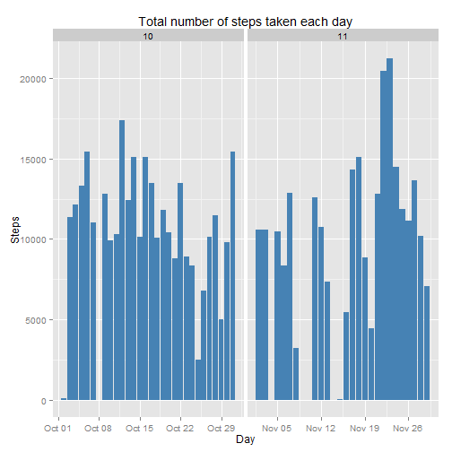

What is mean total number of steps taken per day?
=================================================

Make a histogram of the total number of steps taken each day

```r
dat <- read.csv("activity.csv")
head(dat,5)
```

```
##   steps       date interval
## 1    NA 2012-10-01        0
## 2    NA 2012-10-01        5
## 3    NA 2012-10-01       10
## 4    NA 2012-10-01       15
## 5    NA 2012-10-01       20
```

```r
dat$date <- as.Date(dat$date, format = "%Y-%m-%d")
dat$month <- as.numeric(format(dat$date, "%m"))

library(ggplot2)
g <- ggplot(dat, aes(date, steps))
g + geom_bar(stat="identity", fill="steelblue")+labs(title="Total number of steps taken each day", x="Day", y="Steps")+facet_grid(.~month, scales="free")
```

```
## Warning: Removed 576 rows containing missing values (position_stack).
```

```
## Warning: Removed 1728 rows containing missing values (position_stack).
```

 
